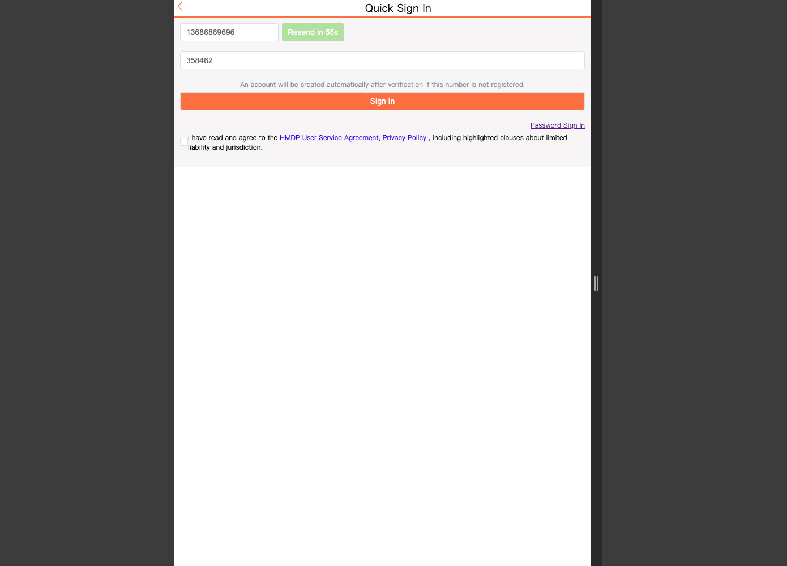
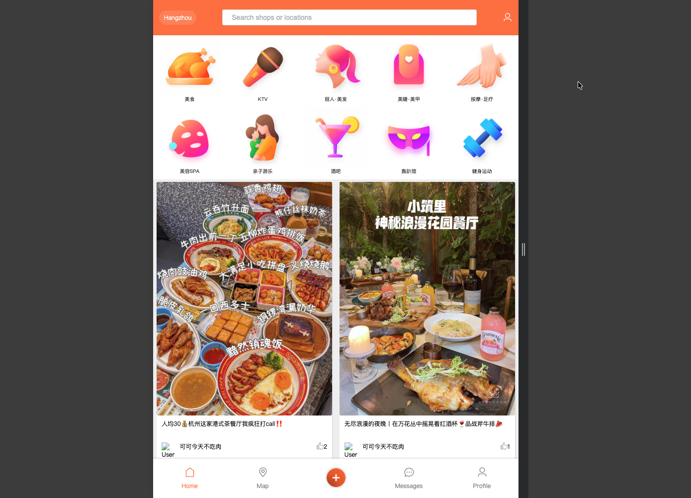
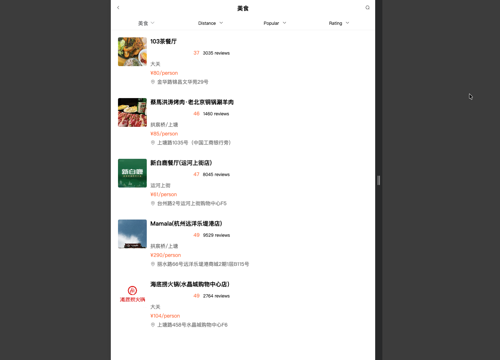
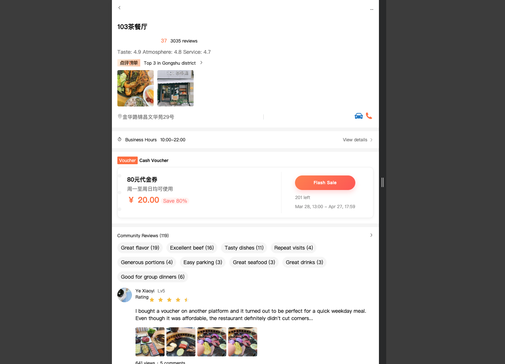
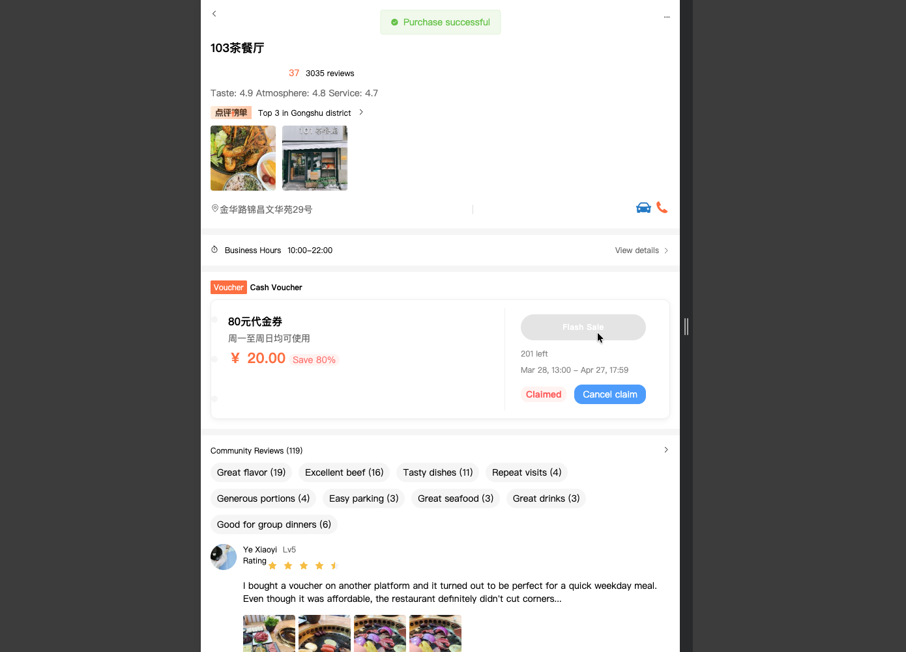
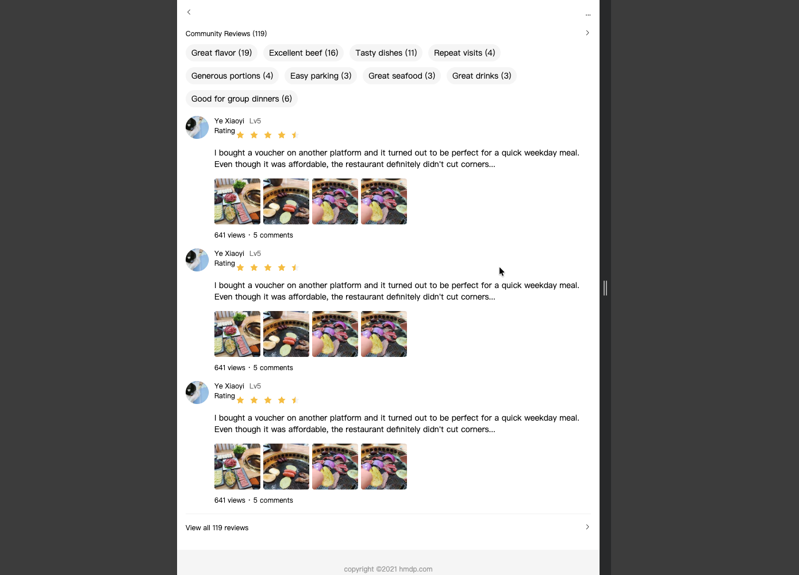
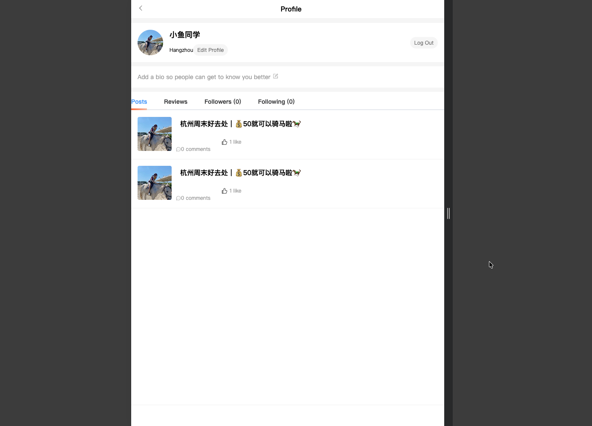
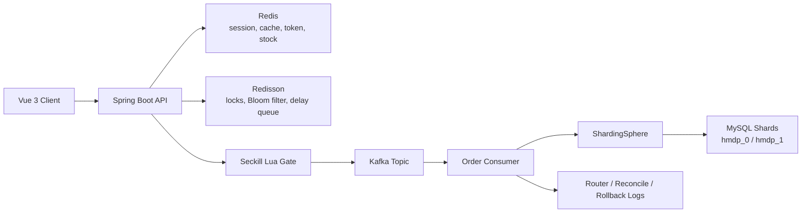

# HMDP Plus

HMDP Plus is a local discovery and voucher flash-sale platform built on a Spring Boot 3 multi-module backend and a Vue 3 mobile-style frontend. The project focuses on the parts that usually get skipped in simple demos: high-concurrency seckill protection, cache penetration and breakdown defense, asynchronous order creation, sold-out subscription queues, delayed reminders, rollback and reconciliation, and sharded MySQL storage.

The current project already covers a complete user path:

- quick sign-in with phone verification code
- home feed with category navigation and community posts
- shop category browsing and shop detail pages
- voucher listing and flash-sale purchase flow
- sold-out restock subscription and auto-issue support
- profile center and personal post list

If you only want to browse the project end to end, start with the phone-code login flow. It is the best-supported path in the current version.

## Table of Contents

- [Project Snapshot](#project-snapshot)
- [Product Walkthrough](#product-walkthrough)
- [Engineering Highlights](#engineering-highlights)
- [Architecture at a Glance](#architecture-at-a-glance)
- [Repository Layout](#repository-layout)
- [Tech Stack](#tech-stack)
- [Quick Start](#quick-start)
- [Configuration Checklist](#configuration-checklist)
- [Core API Flows](#core-api-flows)
- [Data Model and Sharding](#data-model-and-sharding)
- [Current Implementation Notes](#current-implementation-notes)
- [Useful Commands](#useful-commands)
- [License](#license)

## Project Snapshot

This repository is more than a simple "shop + coupon" sample because the product flow and the engineering work live in the same codebase:

- **User-facing product flow**: sign in, browse shops, open shop details, claim vouchers, read reviews, and view personal content.
- **High-concurrency seckill workflow**: one-time access token issuance, Redis/Lua atomic gatekeeping, asynchronous Kafka-based order creation, and order status polling.
- **Cache protection**: local cache, Redis cache, Bloom filters, empty-value markers, and distributed locking are all used to reduce hot-key risk.
- **Subscription and delayed reminder support**: users can wait for sold-out vouchers and the system can auto-issue stock to the earliest subscriber when stock becomes available again.
- **Production-style storage design**: ShardingSphere routes users, vouchers, and orders across multiple databases and physical tables.
- **Operational visibility**: Spring Boot Actuator and Prometheus endpoints are already enabled.

## Product Walkthrough

### 1. Quick sign-in

This is the right place to start. The current demo is built around phone-number verification, and in local development the backend returns the generated code directly, so you can log in without wiring a real SMS provider.

<p align="center">
  
</p>

For local browsing, use the quick sign-in page at `/register` rather than the password page.

- Sample phone numbers already present in the seed data: `13686869696`, `13838411438`
- Example shown in the screenshot: `13686869696` with code `358462`
- Important: the backend does **not** use one fixed default SMS code. After you click **Send Code**, it generates a fresh six-digit code and returns it in the local dev flow. Use that returned code to sign in.
- If the phone number is not registered yet, the backend creates the account automatically after verification.

### 2. Home feed and category discovery

After login, the app opens on a mobile-style home page with a city selector, search bar, category grid, and an infinite-scrolling content feed. It already feels like a real consumer product instead of a backend-only demo: category shortcuts sit at the top, and community posts keep the page alive underneath.

<p align="center">
  
</p>

From this page you can jump into category browsing, open blog content, and move through the bottom navigation just like you would in a local-services app on a phone.

### 3. Shop list by category

Each category opens a list view with the sort and filter patterns people expect from a local-services product. The seed data in this repository has already been translated into English, so the list is readable immediately without any extra cleanup.

<p align="center">
  
</p>

The page is backed by `/shop/of/type` and shows the main shop card fields you would want to test first: rating, review count, area, average spend, and address.

### 4. Shop detail and flash-sale voucher area

This is the most important screen in the project. It is where the product layer meets the concurrency layer: shop information at the top, voucher cards in the middle, and the seckill entry point wired to the backend flow.

<p align="center">
  
</p>

This page loads vouchers from `/voucher/list/{shopId}`, shows stock and time windows, and requests the seckill access token before the client submits the actual purchase.

### 5. Claim success and post-purchase state

Once a voucher is claimed, the UI changes state instead of pretending nothing happened. The claimed badge, success message, and cancel action make the flow easier to verify and reflect the fact that the backend supports cancellation and stock return, not just order creation.

<p align="center">
  
</p>

That post-purchase state is worth documenting because it shows the frontend is tracking real voucher status rather than only firing one request and stopping there.

### 6. Community reviews section

Lower on the shop detail page, the transaction flow gives way to a review section with tags, avatars, ratings, photos, and a "view all reviews" entry. It gives the product a more believable shape: people come here to browse and decide, not only to click a voucher button.

<p align="center">
  
</p>

Even though this part is mostly presentation right now, it helps explain the intended product direction clearly.

### 7. Personal profile center

The profile page closes the loop. It gathers account information and personal content in one place: avatar, nickname, city, editable profile fields, and tabbed areas for posts, reviews, followers, and following.

<p align="center">
  
</p>

For anyone reviewing the project, this page is also a quick way to confirm that user info loading and personal post rendering are already wired.

## Engineering Highlights

### 1. Multi-layer cache protection for shop queries

`ShopServiceImpl` is not using a single cache shortcut. The shop query path includes several layered defenses:

- local in-process cache for very hot data
- Redis as the shared cache layer
- Bloom filter membership check to block impossible IDs early
- empty-value keys to avoid repeated cache-miss penetration
- double-checked distributed locking before falling back to the database

This is a practical read-path design for hot data and invalid-ID traffic.

### 2. Seckill request protection chain

The voucher purchase flow is protected through multiple gates instead of relying on a single database transaction:

- the client first requests a short-lived seckill access token
- the backend validates and consumes that token before allowing the purchase path
- Redis and Lua are used for atomic seckill checks
- duplicate submission protection is present through repeat-execute limiting and lock-based coordination
- Kafka decouples request acceptance from final order persistence
- the frontend polls the order status rather than assuming synchronous persistence

The result is a short request path on the HTTP side and less pressure on the database during bursts.

### 3. Sold-out subscription, auto-issue, and delayed reminders

The project goes beyond "stock is zero, sorry" behavior:

- users can subscribe to sold-out vouchers
- when stock is added back, the system can auto-issue to the earliest waiting subscriber
- delayed reminder support exists for voucher events and audience targeting
- the delayed reminder consumer can filter users by level-based eligibility rules

That makes the inventory flow feel much closer to a real production system than a one-shot seckill demo.

### 4. Data consistency and failure recovery

The backend contains supporting tables and services for consistency work, including:

- voucher order router tables
- voucher reconcile log tables
- rollback failure log tables
- reconciliation task endpoints

That gives the system somewhere to record, inspect, and reconcile partial failures in the async path.

### 5. ShardingSphere-based storage scaling

The storage layer is already split across:

- two logical MySQL databases: `hmdp_0` and `hmdp_1`
- multiple physical tables for users, vouchers, seckill vouchers, orders, routers, and reconcile logs

Sharding rules are declared in [`hmdp-core-service/src/main/resources/shardingsphere.yaml`](hmdp-core-service/src/main/resources/shardingsphere.yaml), which makes this repository useful for engineers who want to see both product code and sharding configuration in one place.

### 6. Metrics and health visibility

The backend exposes:

- `/actuator/health`
- `/actuator/info`
- `/actuator/prometheus`

That is enough for smoke checks, simple dashboards, and performance testing.

## Architecture at a Glance



### Seckill lifecycle

1. The frontend loads vouchers for a shop and renders the voucher card.
2. Before purchase, the frontend calls `/voucher-order/seckill/token/{id}` to request a short-lived access token.
3. The backend verifies rate limits and token eligibility, then runs atomic seckill checks through Redis and Lua.
4. When the request is accepted, the backend publishes a seckill message to Kafka and returns an order identifier quickly.
5. A Kafka consumer persists the actual order and supporting route or log data into sharded MySQL tables.
6. The frontend polls for order confirmation and updates the button state when the order is visible.
7. If a voucher is sold out, users can subscribe; when stock returns, the backend can auto-issue to the waiting queue.

## Repository Layout

| Path | Responsibility |
| --- | --- |
| `hmdp-core-service` | Main Spring Boot application, controllers, services, cache warmup, Kafka consumers and producers, delayed reminder consumers |
| `hmdp-common` | Shared constants, enums, exceptions, and common helper classes |
| `hmdp-parameter` | DTOs, VOs, and request or response payload definitions shared across modules |
| `hmdp-id-generator-framework` | Snowflake-style ID generation |
| `hmdp-redis-tool-framework` | Redis helpers, cache tools, rate limiting, and seckill access token services |
| `hmdp-redisson-framework` | Redisson common utilities, distributed locks, Bloom filter support, delay queue framework, repeat-execute limit support |
| `hmdp-mq-framework` | Kafka producer and consumer abstractions |
| `hmdp-sharding` | Sharding-related support and configuration integration |
| `hmdp-vue3` | Vue 3 frontend application built with Vite, Pinia, Axios, and Element Plus |
| `sql` | Database bootstrap scripts and translated seed data |
| `docs/screenshots` | README screenshots used in this document |

## Tech Stack

| Layer | Technologies |
| --- | --- |
| Backend | Java 17, Spring Boot 3.5, Spring MVC, Spring Validation, Spring Kafka, Spring Actuator |
| Persistence | MyBatis-Plus, MySQL 8, ShardingSphere |
| Cache and concurrency | Redis, Redisson, Lua scripts, Bloom filters, distributed locks |
| Messaging and async | Kafka, delay queue framework |
| Frontend | Vue 3, Vite, Pinia, Axios, Element Plus |
| Monitoring | Prometheus endpoint via Micrometer |
| Build tools | Maven, Node.js, pnpm or npm |

## Quick Start

### 1. Prerequisites

Make sure the following services are available locally before booting the project:

- JDK 17+
- Maven 3.9+
- MySQL 8
- Redis
- Kafka
- ZooKeeper
- Node.js 18+
- pnpm 9+ or npm 10+

Default addresses expected by the current configuration:

- MySQL: `127.0.0.1:3306`
- Redis: `127.0.0.1:6379`
- Kafka: `localhost:9092`
- ZooKeeper: `localhost:2181`
- backend HTTP port: `8085`

### 2. Create and import the databases

Run the bootstrap scripts from the repository root:

```bash
mysql -u root -p < sql/1_create_database.sql
mysql -u root -p < sql/hmdp_0.sql
mysql -u root -p < sql/hmdp_1.sql
```

Notes:

- `sql/hmdp_0.sql` and `sql/hmdp_1.sql` already contain `USE hmdp_0;` and `USE hmdp_1;`.
- The current seed files in this repository are already translated into English demo data.
- `sql/2_translate_seed_data_to_english.sql` is still included if you want to re-apply the English translation layer to older snapshots or custom data.

### 3. Update datasource and infrastructure configuration

Review these files before starting the backend:

- [`hmdp-core-service/src/main/resources/application.yml`](hmdp-core-service/src/main/resources/application.yml)
- [`hmdp-core-service/src/main/resources/shardingsphere.yaml`](hmdp-core-service/src/main/resources/shardingsphere.yaml)

At minimum, confirm:

- MySQL username and password
- MySQL host and port for both shards
- Redis host and port
- Kafka bootstrap servers
- backend server port

### 4. Build the backend

From the repository root:

```bash
mvn clean install -DskipTests
```

### 5. Start the backend

From the repository root:

```bash
mvn -pl hmdp-core-service -am spring-boot:run
```

Verify the service is up:

```bash
curl http://127.0.0.1:8085/actuator/health
```

### 6. Start the frontend

The frontend lives in [`hmdp-vue3`](hmdp-vue3). Because the repository already includes a `pnpm-lock.yaml`, `pnpm` is the recommended package manager, though `npm` can also work.

Using pnpm:

```bash
cd hmdp-vue3
pnpm install
pnpm dev
```

Using npm:

```bash
cd hmdp-vue3
npm install
npm run dev
```

The Vite dev server proxies `/api` requests to `http://localhost:8085` through [`hmdp-vue3/vite.config.js`](hmdp-vue3/vite.config.js).

### 7. Walk through the demo

Suggested local demo path:

1. Open `http://localhost:5173/register`.
2. Use phone-code login first. It is the recommended way to browse the current project.
3. Use a seeded phone number such as `13686869696` or `13838411438`.
4. Click **Send Code** and sign in through the quick sign-in screen.
5. In local development, use the six-digit code returned by the backend. The screenshot shows `358462` as an example, but the code is generated dynamically and is not fixed.
6. Open the home page, browse categories, enter a shop detail page, and try the voucher flow.
7. Visit the profile page to confirm the personal center and post list are wired.

## Configuration Checklist

| File | What to check |
| --- | --- |
| `hmdp-core-service/src/main/resources/application.yml` | backend port, Redis, Kafka, Actuator exposure |
| `hmdp-core-service/src/main/resources/shardingsphere.yaml` | shard datasource URLs, credentials, sharding rules |
| `hmdp-vue3/vite.config.js` | frontend dev proxy target |
| `sql/hmdp_0.sql` and `sql/hmdp_1.sql` | seed tables, translated demo data, voucher and user samples |

## Core API Flows

### Authentication and user profile

| Endpoint | Purpose |
| --- | --- |
| `POST /user/code` | send or generate verification code |
| `POST /user/login` | code-based login and token creation |
| `GET /user/me` | fetch current logged-in user |
| `GET /user/info/{id}` | fetch profile detail |
| `POST /user/sign` | daily sign-in |
| `GET /user/sign/count` | consecutive sign-in count |

### Discovery and content

| Endpoint | Purpose |
| --- | --- |
| `GET /shop-type/list` | load category grid |
| `GET /shop/of/type` | load category shop list |
| `GET /shop/{id}` | load shop detail |
| `GET /blog/hot` | hot blog or note feed |
| `GET /blog/{id}` | blog detail |
| `GET /blog/of/me` | current user's posts |

### Voucher and seckill

| Endpoint | Purpose |
| --- | --- |
| `GET /voucher/list/{shopId}` | load vouchers for a shop |
| `GET /voucher-order/seckill/token/{id}` | request one-time seckill access token |
| `POST /voucher-order/seckill/{id}` | place seckill request with access token |
| `POST /voucher-order/get/seckill/voucher/order-id` | poll for final seckill order |
| `POST /voucher-order/get/seckill/voucher/order-id/by/voucher-id` | check whether the current user already owns a voucher |
| `POST /voucher-order/cancel` | cancel claimed voucher |
| `POST /voucher/subscribe` | join sold-out waiting queue |
| `POST /voucher/unsubscribe` | leave waiting queue |
| `POST /voucher/get/subscribe/status/batch` | batch query waiting status |

## Data Model and Sharding

According to [`hmdp-core-service/src/main/resources/shardingsphere.yaml`](hmdp-core-service/src/main/resources/shardingsphere.yaml), the project uses two datasource shards:

- `ds_0` -> `hmdp_0`
- `ds_1` -> `hmdp_1`

### Sharded tables

The following entities are sharded across databases and physical tables:

- `tb_seckill_voucher`
- `tb_user`
- `tb_user_info`
- `tb_user_phone`
- `tb_voucher`
- `tb_voucher_order`
- `tb_voucher_order_router`
- `tb_voucher_reconcile_log`

### Broadcast tables

These tables are configured as broadcast tables:

- `tb_blog`
- `tb_blog_comments`
- `tb_follow`
- `tb_rollback_failure_log`
- `tb_shop`
- `tb_shop_type`
- `tb_sign`

This combination is sensible for the business model:

- hot transactional entities scale horizontally
- shared reference and social tables stay consistent everywhere

## Current Implementation Notes

This section is intentionally honest so new contributors know what is fully wired today.

- The **verification-code login flow** is the main end-to-end authentication path and the one you should use when reviewing the project.
- The **password sign-in page exists in the frontend UI**, but the backend login implementation currently validates the verification code path rather than a separate password-auth flow.
- `POST /user/logout` currently returns a "Feature not implemented" response.
- `ShopServiceImpl.queryShopByType()` contains a Redis GEO branch, but the current code nulls out the incoming coordinates, so category pages presently fall back to database pagination instead of distance-based GEO sorting.
- The shop-detail review area is currently a polished frontend presentation section; the main live social content flow is still driven by blog endpoints such as `/blog/hot` and `/blog/of/me`.

These are not blockers for learning or demo use, but they are good next-step candidates if you want to keep evolving the project.

## Useful Commands

Build everything:

```bash
mvn clean install
```

Run the backend only:

```bash
mvn -pl hmdp-core-service -am spring-boot:run
```

Frontend dev server:

```bash
cd hmdp-vue3
pnpm dev
```

Frontend production build:

```bash
cd hmdp-vue3
pnpm build
```

Backend health endpoint:

```bash
curl http://127.0.0.1:8085/actuator/health
```

Prometheus metrics:

```bash
curl http://127.0.0.1:8085/actuator/prometheus
```

## License

This repository includes the Apache License 2.0 text in [LICENSE](LICENSE).
